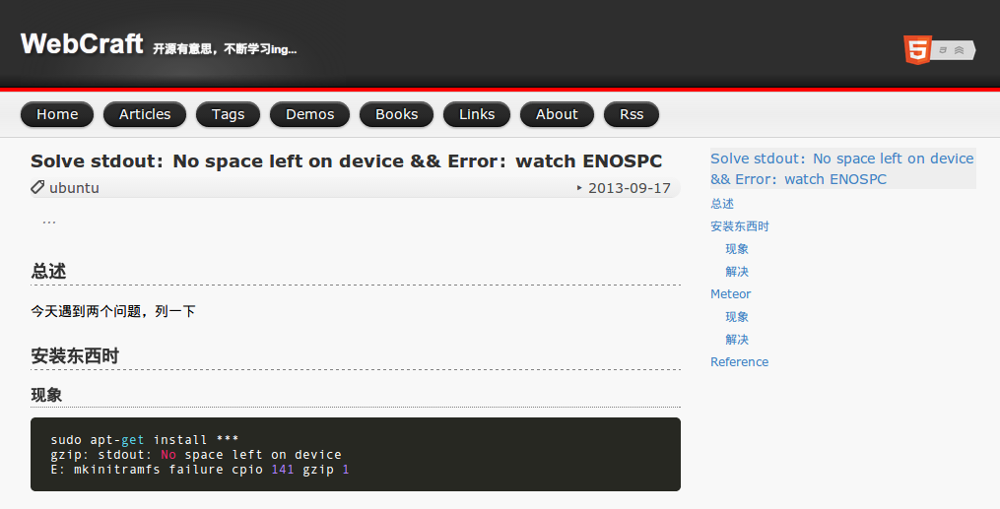

# Nevermore

## Shadow Fiend(Nevermore) 简介

据说影魔奈文摩尔有着一个诗人的灵魂，事实上，他吞噬的诗人灵魂早已成千上万。千百年来，他收集了各式各样的灵魂，包括诗人，牧师，帝王，乞丐，奴隶，哲人，罪犯，当然，还有英雄。他拥有着世间所有种类的灵魂。然而没人知道他收集这些灵魂作何之用。从来没有人得以窥视影魔的魂渊之秘，他从魂渊中伸出灵魂触须，蔓延在精神位面。他是把灵魂一个个吞噬了？还是把灵魂堆积在他的影惧神殿里？又或是将灵魂浸在死灵之池中？难道他仅仅是一个被恶魔傀儡大师操纵着，通过位面裂口进入世界的傀儡？尽管众说纷纭，但根本没有人能看透他那黑暗光环下的层层邪恶。然而，如果你实在是很想知道那些灵魂的归宿，有个办法能帮你达成心愿：凡人，将你的灵魂奉献给影魔，或者等待魔王的收割！ 

## 闲扯

个人折腾，本地运行正常（没有错误），GitHub 由于版本原因，不能正常编译。

取了一个折中的解决方案，源代码放在 `nevermore` 库中，生成的  `_site` 里的内容，`copy` 到 malei0311.github.com 中，支持访问。

## 预览

